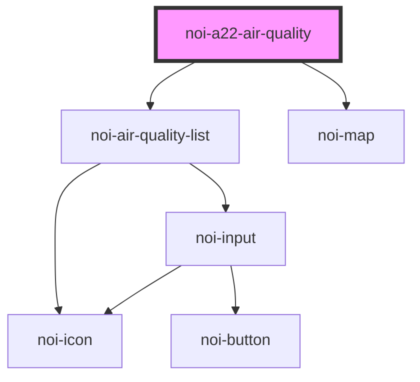

<!--
SPDX-FileCopyrightText: NOI Techpark <digital@noi.bz.it>

SPDX-License-Identifier: CC0-1.0
-->
# noi-a22-air-quality

<!-- Auto Generated Below -->

## Overview

Road air quality component

## Properties

| Property   | Attribute  | Description       | Type                                          | Default  |
| ---------- | ---------- | ----------------- | --------------------------------------------- | -------- |
| `language` | `language` | Language          | `string`                                      | `'en'`   |
| `layout`   | `layout`   | Layout appearance | `"auto" \| "desktop" \| "mobile" \| "tablet"` | `'auto'` |

## Methods

### `refreshData() => Promise<void>`

Reload camera data

#### Returns

Type: `Promise<void>`

## Shadow Parts

| Part            | Description     |
| --------------- | --------------- |
| `"footer"`      |                 |
| `"list"`        | stations list   |
| `"map"`         | Map             |
| `"marker"`      | Map marker      |
| `"marker-icon"` | Map marker icon |
| `"popup"`       | Popup dialog    |

## CSS Custom Properties

| Name                                   | Description                                     |
| -------------------------------------- | ----------------------------------------------- |
| `---color-air-extremely-poor-contrast` | Contrast color for 'extremely poor' air quality |
| `---color-air-poor-contrast`           | Contrast color for 'poor' air quality           |
| `---color-air-very-poor-contrast`      | Contrast color for 'very poor' air quality      |
| `--color-air-extremely-poor`           | Color for 'extremely poor' air quality          |
| `--color-air-fair`                     | Color for 'fair' air quality                    |
| `--color-air-fair-contrast`            | Contrast color for 'fair' air quality           |
| `--color-air-good`                     | Color for 'good' air quality                    |
| `--color-air-moderate`                 | Color for 'moderate' air quality                |
| `--color-air-moderate-contrast`        | Contrast color for 'moderate' air quality       |
| `--color-air-poor`                     | Color for 'poor' air quality                    |
| `--color-air-unknown`                  | Color for unknown/missing air quality           |
| `--color-air-very-good-contrast`       | Contrast color for 'good' air quality           |
| `--color-air-very-poor`                | Color for 'very poor' air quality               |
| `--color-background`                   | Background color                                |
| `--color-footer`                       | Footer background color                         |
| `--color-primary`                      | Primary color                                   |
| `--color-primary-rgb`                  | Primary color in RGB format                     |
| `--color-secondary`                    | Secondary color                                 |
| `--color-tertiary`                     | Third color                                     |
| `--color-text`                         | Text color                                      |
| `--map-line-color`                     | Map line color                                  |
| `--scrollbar-bg`                       | Scrollbar background color                      |
| `--scrollbar-color`                    | Scrollbar thumb color                           |

## Dependencies

### Depends on

- [noi-air-quality-list](./partials/air-quality-list)
- [noi-map](../../blocks/map)

### Graph

----------------------------------------------

*Built with [StencilJS](https://stenciljs.com/)*
